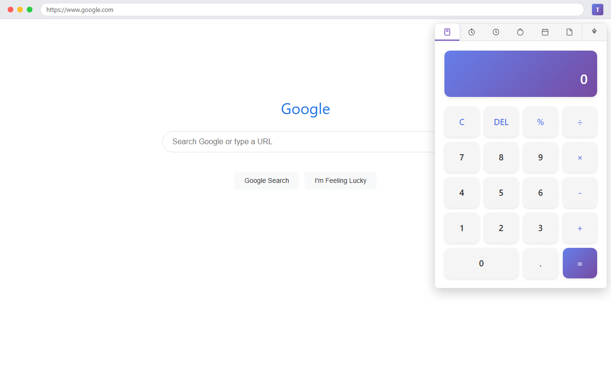
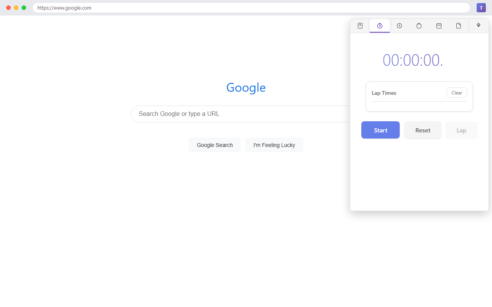
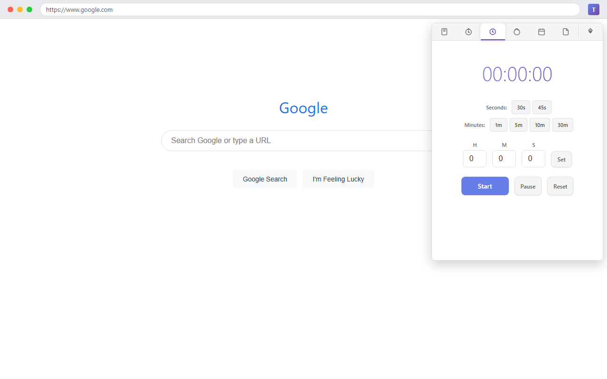
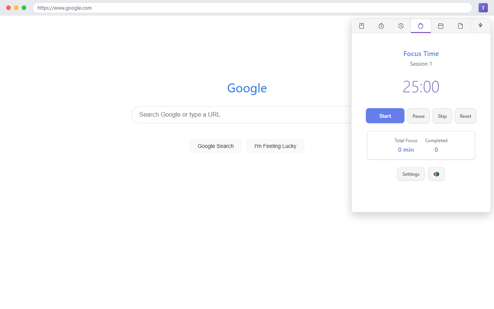
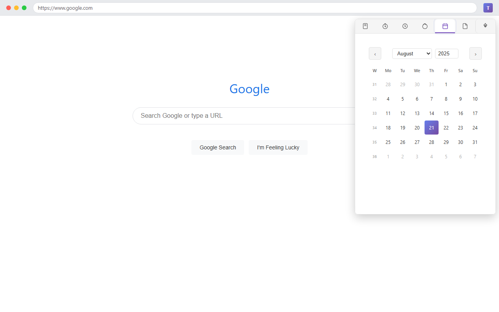
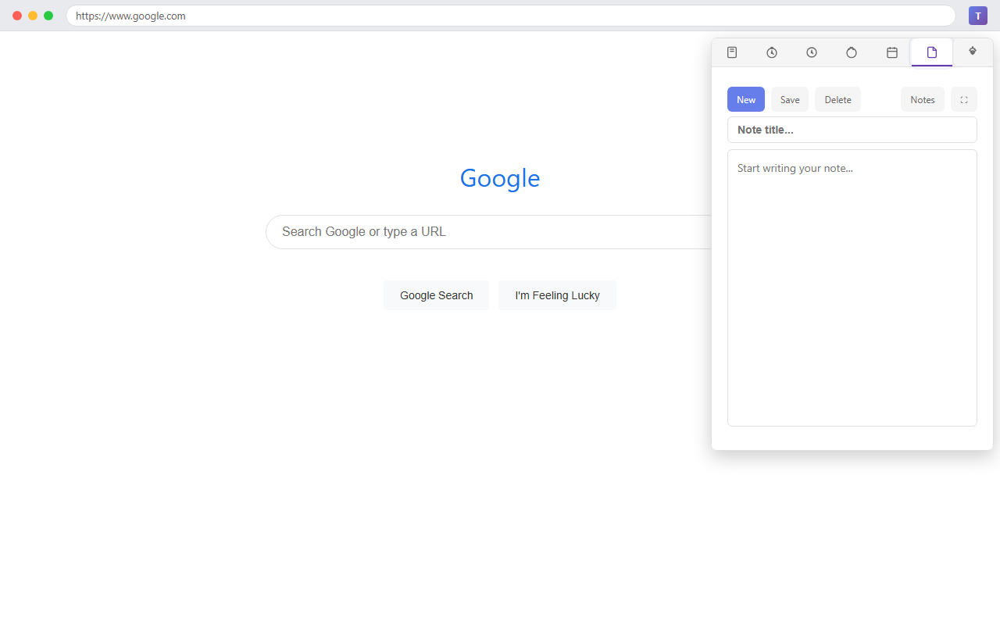
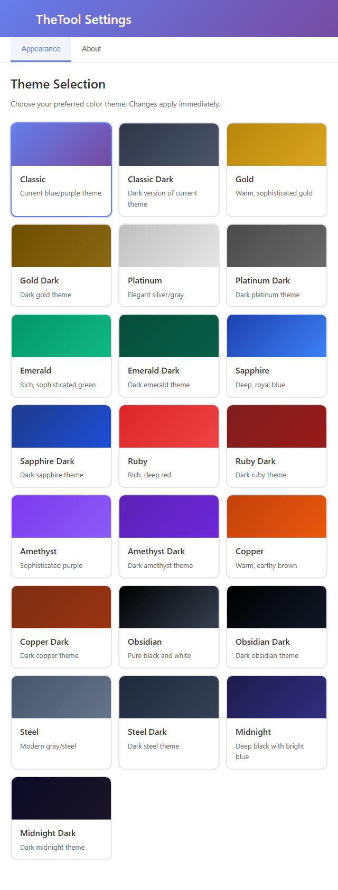

# TheTool - All-in-One Productivity Chrome Extension

A powerful Chrome extension providing instant access to essential productivity tools directly from your browser toolbar. Built with zero animations for lightning-fast performance and complete offline functionality.

## 🚀 Features

### 🧮 **Calculator**

### ⏱️ **Stopwatch**

### ⏰ **Countdown Timer**

### 🍅 **Pomodoro Timer**

### 📅 **Calendar**

### 📝 **Notes**

### ⚙️ **Options Page**

## ⚡ Performance Features

- **Zero animations** - Instant tool switching for maximum speed
- **Offline-first** - All tools work without internet connection
- **Memory efficient** - Lightweight code with minimal resource usage

## 🎯 Quick Start

### Installation
1. Download or clone this repository
2. Open Chrome and navigate to `chrome://extensions/`
3. Enable "Developer mode" (top-right toggle)
4. Click "Load unpacked" and select the TheTool folder
5. Pin the extension to your toolbar for quick access

## 🛡️ Privacy & Security

- **No external calls** - Everything runs locally
- **No tracking** - Zero analytics or user monitoring  
- **Minimal permissions** - Only requests necessary access
- **Open source** - Full code transparency

## 📖 Keyboard Shortcuts Reference

| Tool | Action | Shortcut |
|------|--------|----------|
| **Global** | Switch tools | Alt+1-6 |
| **Calculator** | Numbers/operators | 0-9, +, -, *, / |
| **Calculator** | Equals | Enter or = |
| **Calculator** | Clear | Escape |
| **Calculator** | Delete | Backspace |
| **Stopwatch** | Start/Stop | Space/Enter |
| **Stopwatch** | Lap | L |
| **Stopwatch** | Reset | R |
| **Timer** | Start/Pause | Space/Enter |
| **Timer** | Reset | R |
| **Pomodoro** | Start/Pause | Space/Enter |
| **Pomodoro** | Skip phase | S |
| **Calendar** | Navigate | Arrow keys |
| **Calendar** | Go to today | Home |
| **Notes** | New note | Ctrl+N |
| **Notes** | Save | Ctrl+S |

## 🤝 Contributing

Feel free to submit issues, fork the repository, and create pull requests for improvements.

